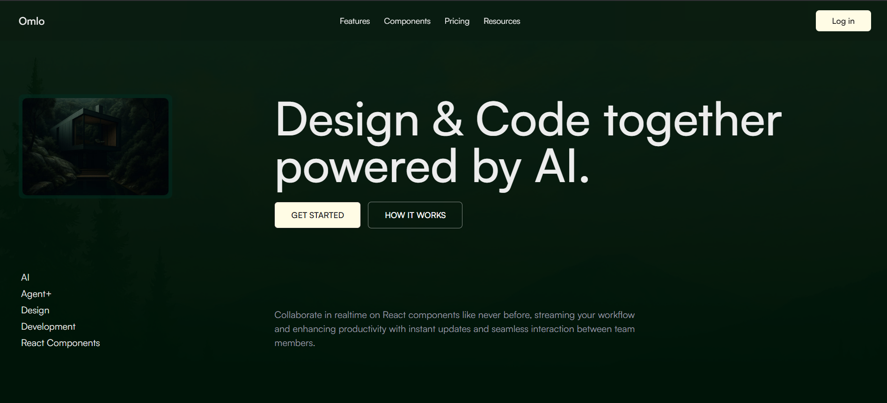
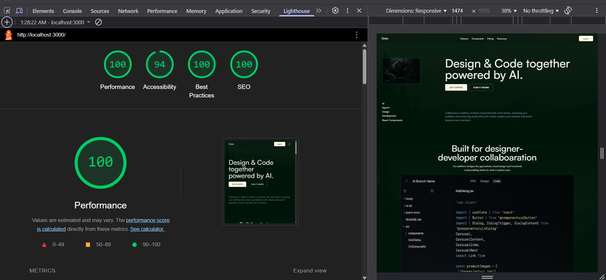

# 🧠 Omlo – Design & Code Together, Powered by AI

A stunning, AI-powered landing page for **Omlo**, built with ⚡ Next.js. Designed to be the ultimate playground where **designers and developers** can build React components together, live, and without chaos.



---

## 🚀 Features

- 🧠 **AI-Powered Workflows**  
  Start faster with auto-customized React components generated by AI.

- 🎨 **Visual Component Editing**  
  Edit, polish, and perfect your components visually—layouts, styles, all in your control.

- ⚛️ **Real-time Collaboration**  
  Build React components collaboratively with live syncing. No refreshes. Just vibes.

- 📚 **Design System Friendly**  
  Import from Storybook or spin up your own component library in minutes.

- 🧩 **Works With Any Codebase**  
  Plug and play with any React codebase. Minimal setup. Maximum flexibility.

---

## 📦 Tech Stack

- Next.js
- React
- Tailwind CSS
- NPM
- Custom UI components
- FRAMER MOTION

---

## 🧪 Performance

> Bro, even the Lighthouse thinks it’s 🔥  
> These scores are higher than my whole 12th boards.

| Metric         | Score |
|----------------|-------|
| Performance    | 100   |
| SEO            | 100   |
| Best Practices | 100   |
| Accessibility  | 94    |



---

## 💸 Pricing

| Plan        | Price       | Billing     |
|-------------|-------------|-------------|
| Starter     | $30         | Quarterly   |
| Pro         | $75         | Quarterly   |
| Lifetime    | $4,999      | One-time    |

💡 _Save more on annual plans. Book a call or get started instantly._

---

## 📂 File Structure

```bash
.
├── public/
│   ├── preview.png       # Screenshot of the landing page
│   └── lh.png            # Lighthouse performance scores
├── src/
│   ├── components/
│   └── app/
├── lib/
├── README.md
└── package.json
````

---

## 📸 Screenshots

> Just in case the live demo doesn't slap enough

**Landing Page Preview**


**Lighthouse Results**


---

## 🤝 What will your team create – together?

### → [GET STARTED](#)

---

### ⚠️ Side effects of using Omlo may include:

* Massive productivity boosts
* A healthier designer-dev relationship
* Random bursts of joy when code works first try

---

🧑‍💻 Built by devs who got tired of copy-pasting Figma specs
📬 Wanna collab? Let’s talk.
---
